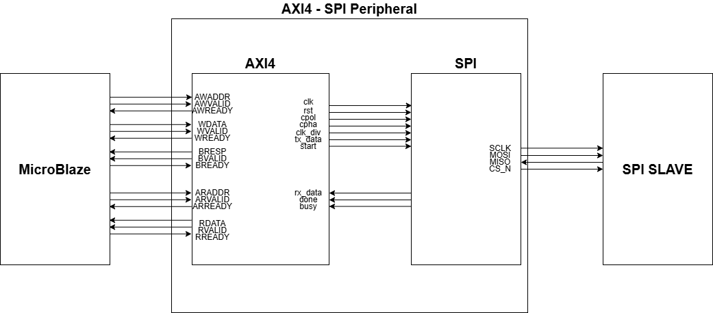
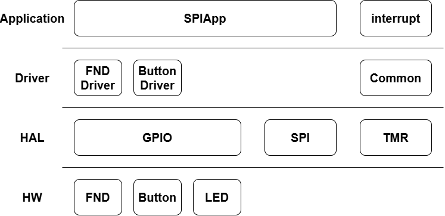
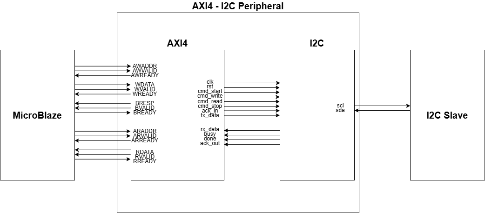
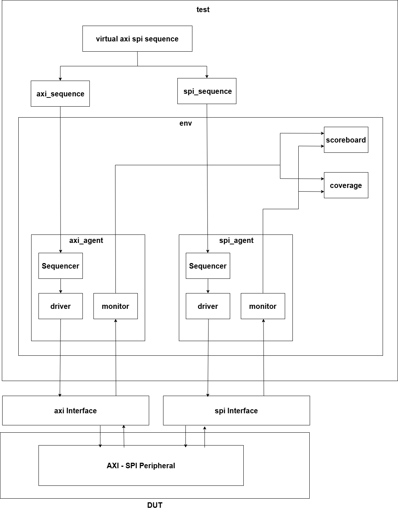
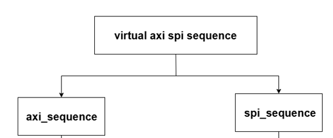
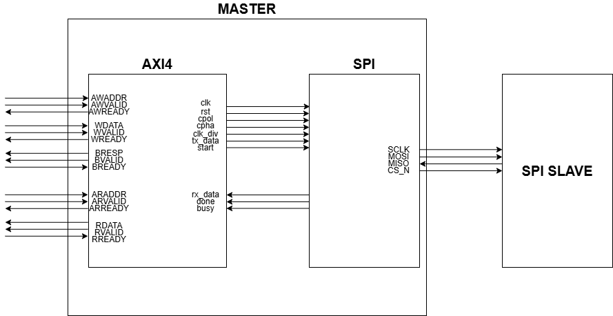
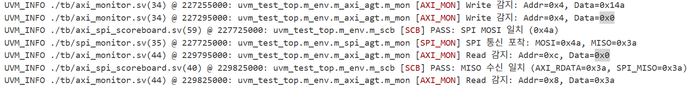
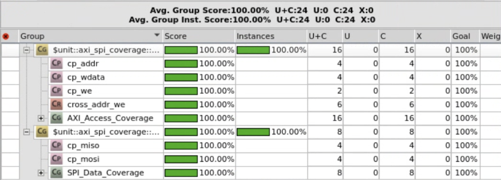

# MicroBlaze 기반 Custom AXI SoC 설계 및 검증

AMBA **AXI4-Lite** 인터페이스를 갖는 **SPI / I2C Peripheral IP**를 직접 설계하고,
MicroBlaze 기반 SoC에 통합하여 **FPGA 보드 간 통신**을 구현한 뒤,
**UVM 환경으로 기능 검증**까지 수행한 프로젝트입니다.

| 항목 | 내용 |
|---|---|
| 수행 기간 | 2026.04 |
| 담당 역할 | AXI4-Lite Peripheral IP(SPI/I2C) RTL 설계, 펌웨어 구현, SPI Peripheral UVM 검증 |
| 사용 언어 | SystemVerilog, Verilog, C |
| 사용 기술 | AXI4-Lite, SPI, I2C, UVM, MicroBlaze |
| 사용 툴 | Vivado, Vitis IDE, VCS, Verdi |
| 검증 보드 | AMD Basys3 (Artix-7) × 2대 |

---

## 1. 프로젝트 개요

Xilinx가 제공하는 IP를 가져다 쓰는 대신, **AXI4-Lite Slave 인터페이스를 직접 RTL로 구현**하여
SPI·I2C Master를 Custom Peripheral IP로 만들고 MicroBlaze에 연결했습니다.

동작 확인은 실제 하드웨어에서 수행했습니다.
FPGA 한 대에 **Master IP**를, 다른 한 대에 **RTL로 설계한 Slave 모듈**을 올려
두 보드 사이에서 Read / Write 동작이 모두 정상적으로 이루어지는지 확인했습니다.

- 입력: FPGA 슬라이드 스위치 8bit (송신 데이터)
- 출력: 7-segment display (수신 데이터), LED (busy / done 상태)

---

## 2. 저장소 구조

```
.
├── src/
│   ├── AXI_SPI_UVM_Verification/     # SPI Peripheral UVM 검증 환경
│   │   ├── rtl/                      # 검증 대상(DUT)
│   │   │   ├── SPI_v1_0.v            # IP Top (AXI Slave wrapper)
│   │   │   ├── SPI_v1_0_S00_AXI.v    # AXI4-Lite Slave + Register Map + user logic
│   │   │   └── spi_master.sv         # SPI Master FSM
│   │   ├── tb/                       # UVM 컴포넌트
│   │   ├── filelist.f
│   │   └── Makefile
│   ├── MicroBlaze_SPI/                              # SPI Master 보드 Vivado/Vitis 프로젝트
│   │   ├── 260430_MicroBlaze_SPI.srcs/               # Vivado 소스 (constraint 등)
│   │   │   └── constrs_1/imports/OnDeviceAI/Basys-3-Master.xdc
│   │   └── vitis_workspace/MicroBlaze_SPI_Master/src/   # MicroBlaze 펌웨어 (Layered Architecture)
│   │       ├── ap/                   # Application  : SpiApp, interrupt
│   │       ├── driver/               # Driver       : FND, Button
│   │       ├── HAL/                  # HAL          : SPI, GPIO, TMR
│   │       └── common/
│   ├── MicroBlaze_I2C/                              # I2C 보드 Vivado/Vitis 프로젝트
│   │   ├── 260430_MicroBlaze_I2C.srcs/
│   │   │   └── constrs_1/imports/OnDeviceAI/Basys-3-Master.xdc
│   │   └── vitis_workspace/MicroBlaze_I2C/src/          # I2CApp 기반 펌웨어 (ap/driver/HAL/common)
│   └── ip_repo/                      # Vivado Custom IP 패키징
│       ├── SPI_1.0/hdl/              # SPI_v1_0.v, SPI_v1_0_S00_AXI.v, spi_master.sv
│       ├── I2C_1.0/hdl/              # I2C_v1_0.v, I2C_v1_0_S00_AXI.v, i2c_master.sv
│       └── GPIO_1.0, GPIO8_1.0, TMR_1.0, uart_1.0, myip_1.0/  # 기타 Custom IP
└── docs/                             # 블록도 및 검증 결과 이미지
```

> UVM 검증 환경은 **SPI Peripheral**을 대상으로 구축했습니다.

---

## 3. 시스템 구성

### 3.1 Block Design



MicroBlaze를 중심으로 직접 설계한 SPI Peripheral IP와 GPIO, Timer IP를
AXI Interconnect에 연결해 SoC를 구성했습니다.

| IP | 용도 |
|---|---|
| `SPI_0` / `I2C_0` | **직접 설계한 Custom Peripheral IP** (`sclk`/`mosi`/`miso`/`cs_n`, `scl`/`sda`) |
| `GPIO8_0` (GPIOA) | FND digit 선택, 시작 버튼 입력, 상태 LED 출력 |
| `GPIO8_1` (GPIOB) | FND segment 데이터 출력 |
| `GPIO8_2` (GPIOC) | 슬라이드 스위치 입력 (송신 데이터) |
| `TMR_0` / `TMR_1` | ms 단위 delay, FND 동적 구동용 인터럽트 소스 |

**포트 매핑**

| 포트 | 연결 |
|---|---|
| `GPIOA[3:0]` | fnd_digit[3:0] |
| `GPIOA[4]` | right button (전송 시작) |
| `GPIOA[5]` | LED0 — done |
| `GPIOA[6]` | LED1 — busy |
| `GPIOB[7:0]` | fnd_data[7:0] |
| `GPIOC[7:0]` | sw[7:0] — 송신 데이터 입력 |

### 3.2 IP Hierarchy



`SPI_v1_0` (IP Top) → `SPI_v1_0_S00_AXI` (AXI Slave + Register) → `spi_master` (Protocol FSM)
의 3계층 구조입니다. AXI 인터페이스와 프로토콜 로직을 분리해,
동일한 AXI Slave 구조 위에 I2C Master를 얹는 방식으로 재사용했습니다.



---

## 4. RTL 설계

### 4.1 AXI4-Lite Slave

AW / W / B / AR / R 5개 채널을 VALID–READY 핸드셰이크로 구현했습니다.

- 32-bit 데이터 폭, 4개 레지스터 (word 단위 정렬)
- **Write**: `awready`·`wready`가 모두 assert된 시점에 레지스터 갱신 → `bvalid`로 OKAY 응답
- **Read**: `arvalid` 수락 시 주소 래치 → 주소 디코딩 → `rvalid`와 함께 `rdata` 반환
- Write 시 `WSTRB` 기반 byte-enable 적용

### 4.2 Register Map

| Offset | 이름 | R/W | 필드 |
|---|---|---|---|
| `0x00` | **CTRL** | RW | `[0]` CPOL · `[1]` CPHA · `[15:8]` CLK_DIV |
| `0x04` | **TX** | RW | `[7:0]` TX Data · `[8]` START |
| `0x08` | **RX** | RO | `[7:0]` RX Data |
| `0x0C` | **STATUS** | RO | `[0]` BUSY · `[1]` DONE |

`START`는 **soft trigger** 방식입니다. 1로 write하여 전송을 시작한 뒤
곧바로 0으로 clear해, STOP → IDLE 복귀 시 전송이 재트리거되지 않도록 했습니다.

### 4.3 SPI Master FSM

```
IDLE ──start──> START ──> DATA ──bit_cnt==7──> STOP ──> IDLE
```

| State | 동작 |
|---|---|
| `IDLE` | `cs_n=1`, `sclk`을 CPOL로 유지. `start` 감지 시 shift register 로드 |
| `START` | CPHA=0인 경우 첫 비트를 미리 MOSI에 출력 (첫 edge에서 샘플링되므로) |
| `DATA` | `clk_div` 기반 `half_tick`마다 `sclk` toggle. 8bit MSB-first 송수신 |
| `STOP` | `cs_n=1`, `done` 1-cycle pulse 후 IDLE 복귀 |

- **CPOL / CPHA 4개 모드 지원** — `step` 플래그로 half-cycle을 구분해
  샘플링 edge와 드라이브 edge를 모드별로 분리 처리
- **클럭 분주** — `clk_div` 카운터가 만드는 `half_tick`으로 SCLK 주기 조정
  (시뮬레이션 `clk_div=2`, 보드 동작 확인 `clk_div=200`)

### 4.4 I2C Master

START / STOP condition, 7-bit 주소 + R/W, ACK/NACK 처리를 포함한 별도 FSM으로 구현하고,
동일한 AXI4-Lite Slave 구조 위에 연결했습니다.


---

## 5. 펌웨어 (MicroBlaze)

재사용성과 유지보수를 고려해 **Layered Architecture**로 구성했습니다.

```
Application   SpiApp / I2CApp, interrupt
    ↓
Driver        FND, Button
    ↓
HAL           SPI, GPIO, TMR
    ↓
Hardware      Custom AXI Peripheral IP
```

상위 계층은 하위 계층의 API만 호출하고, **레지스터 주소는 HAL 내부에만** 존재합니다.
레지스터 맵이 바뀌어도 HAL만 수정하면 되도록 의존성을 분리했습니다.
직접 설계한 **Timer IP(TMR)** 를 External Interrupt 소스로 사용했습니다.

```c
// SpiApp_Execute()
if (Button_GetState(&hBtnStart) == ACT_PUSHED) {
    uint8_t tx = GPIO_ReadPort(GPIOC);   // 스위치 8bit 입력
    GPIO_WritePin(GPIOA, GPIO_PIN_6, SET);   // busy LED on
    SPI_Send(tx);                        // TX 레지스터 write + START
    while (SPI_IsBusy());                // STATUS 폴링
    FND_SetNum(SPI_ReadRx());            // RX 레지스터 read → FND 출력
    GPIO_WritePin(GPIOA, GPIO_PIN_5, SET);   // done LED on
}
```

---

## 6. UVM 검증

### 6.1 환경 구조



DUT가 **AXI(입력)** 와 **SPI(출력)** 라는 서로 다른 두 인터페이스를 갖기 때문에,
Agent를 두 개 두고 **Virtual Sequencer / Virtual Sequence**로 시나리오를 통합 제어했습니다.

| 컴포넌트 | 역할 |
|---|---|
| `axi_agent` | AXI4-Lite Master 역할. 레지스터 read/write 트랜잭션 구동 |
| `spi_agent` | SPI Slave 역할. `cs_n` assert를 감지해 MISO로 응답 데이터 구동 |
| `axi_spi_scoreboard` | 양방향 예측 큐 기반 자동 비교 |
| `axi_spi_coverage` | AXI 접근 / SPI 데이터 Functional Coverage 수집 |
| `axi_spi_virtual_sequence` | 두 Agent의 시퀀스를 하나의 시나리오로 동기화 |

### 6.2 Virtual Sequence



두 시퀀스를 지휘하는 상위 시퀀스로, `fork-join`을 사용해
**Master 전송과 Slave 응답 준비를 동시에 실행**합니다.
각 하위 시퀀스의 역할은 다음과 같습니다.

- `axi_sequence` — 인터페이스 전송의 최소 단위. 특정 주소에 데이터를 쓰거나 읽음
- `spi_sequence` — SPI 인터페이스 상에서 Slave 응답(MISO) 랜덤 데이터 준비

### 6.3 검증 시나리오



Virtual Sequence는 다음 순서를 반복 수행합니다.

1. CTRL 레지스터 설정 (`clk_div=2`, CPOL=0, CPHA=0)
2. `fork`
   - SPI Slave 시퀀스: 랜덤 MISO 응답 데이터 준비
   - AXI 시퀀스: TX 레지스터에 랜덤 데이터 + START write → 즉시 START clear
3. 하드웨어 전송 완료 대기
4. STATUS 레지스터 read
5. RX 레지스터 read → **스코어보드 MISO 비교 트리거**
6. CTRL / TX 레지스터 read-back → RW 레지스터 읽기 경로 검증 (`cross_addr_we` 커버리지 완성)

Constrained Randomize를 AXI→SPI(MOSI), SPI→AXI(MISO) 양방향 데이터에 적용했습니다.

### 6.4 Scoreboard

방향이 다른 두 데이터 흐름을 각각 큐로 관리해 비교합니다.

| 큐 | Push | Pop & Compare |
|---|---|---|
| `expected_mosi_q` | AXI가 TX+START를 write할 때 | SPI Monitor가 실제 MOSI를 포착했을 때 |
| `expected_miso_q` | SPI Monitor가 Slave 응답을 포착했을 때 | AXI가 RX 레지스터를 read했을 때 |

즉 **AXI WDATA == SPI MOSI**, **SPI MISO == AXI RDATA** 두 조건을 모두 확인하며,
`report_phase`에서 PASS/FAIL 누계를 출력합니다.



### 6.5 Functional Coverage

| Covergroup | Coverpoint |
|---|---|
| `axi_cg` | `cp_addr` (CTRL/TX/RX/STATUS), `cp_we` (read/write), `cp_wdata` (0x00–0xFF 4구간), `cross_addr_we` |
| `spi_cg` | `cp_mosi`, `cp_miso` (각 0x00–0xFF 4구간) |

Read-Only 레지스터에 대한 write는 발생할 수 없으므로 `ignore_bins`로 제외했습니다.



### 6.6 검증 결과

| 항목 | 결과 |
|---|---|
| 트랜잭션 비교 | **200건 전부 PASS** |
| Functional Coverage | **100%** |

`cross_addr_we`는 초기 66.67%에서 출발했으며, 원인 분석과 해결 과정은 8장에 정리했습니다.

---

## 7. 실행 방법

### RTL 시뮬레이션 (VCS + Verdi)

```bash
cd src/AXI_SPI_UVM_Verification

make sim                            # 컴파일 + 시뮬레이션
make sim TC=axi_spi_test SEED=1234  # 테스트/시드 지정
make verdi                          # 파형 확인 (novas.fsdb)
make vc                             # 커버리지 확인 (coverage.vdb)
make clean
```

Makefile에는 `line + cond + fsm + tgl + branch + assert` 커버리지 옵션이 포함되어 있습니다.

### FPGA 구현

1. Vivado에서 `src/ip_repo/{SPI_1.0, I2C_1.0}/hdl` 소스로 Custom IP 패키징
2. Block Design에 MicroBlaze + Custom IP + GPIO + TMR 연결 후 bitstream 생성
3. Vitis에서 `src/MicroBlaze_SPI/vitis_workspace`, `src/MicroBlaze_I2C/vitis_workspace` 임포트 후 두 보드에 각각 Master / Slave 다운로드

---

## 8. 문제 해결 및 배운 점

### Agent가 2개인 환경의 시퀀스 제어

이전까지는 단일 Agent 환경만 다뤄봤기 때문에, AXI와 SPI 두 Agent의 동작 순서를
어떻게 맞출지가 가장 큰 고민이었습니다. 각 시퀀스를 따로 실행하면
"Slave 응답 준비"보다 "Master 전송 시작"이 먼저 일어나 타이밍이 어긋났습니다.

이를 해결하기 위해 **Virtual Sequencer / Virtual Sequence**를 도입해
두 Agent의 시퀀스를 상위 시나리오에서 `fork-join`으로 동기화했습니다.
서로 다른 인터페이스를 갖는 DUT에서 왜 virtual sequence가 필요한지를
직접 겪으며 이해할 수 있었던 부분입니다.

### START 비트의 무한 재트리거

START를 1로 유지하면 STOP → IDLE 복귀 직후 전송이 다시 시작되어
동일 데이터가 반복 전송되는 문제가 있었습니다.
전송 시작 직후 START를 0으로 clear하는 방식으로 해결했습니다.

### 초기값 X로 인한 드라이버 정지

MISO를 초기화하지 않으면 값이 `X` 상태로 남아 드라이버가 신호 변화를 감지하지 못하고
대기 상태에 머물렀습니다. 테스트벤치에서 초기값을 명시해 해결했습니다.

### 커버리지 미달, 자극을 늘릴 문제인가 배제할 문제인가

1차 시뮬레이션에서 `cross_addr_we`가 66.67%(4/6)에 머물렀습니다.
처음엔 트랜잭션 수를 늘리면 채워질 거라 생각했지만 값이 그대로였습니다.

원인은 시나리오가 CTRL·TX를 **write로만** 접근한다는 점이었습니다.
랜덤화 대상은 데이터 값뿐이고 주소·방향은 고정이라, `CTRL+read`/`TX+read`는
반복 횟수와 무관하게 발생할 수 없는 **구조적 미달**이었습니다.

`ignore_bins`로 제외하면 100%는 만들 수 있었지만, 두 레지스터는 read mux에서
저장값을 반환하도록 구현된 **RW 레지스터**였습니다. 읽기 경로가 실제로 존재하는데
검증만 안 된 상태라, 배제하는 것은 미검증 로직을 가리는 선택이었습니다.
(RX·STATUS는 쓰기 경로 자체가 없어 `ignore_bins`가 타당한 경우입니다.)

read-back 시퀀스를 추가해 읽기 경로까지 자극했고 `cross_addr_we` 6/6을 달성했습니다.
커버리지 미달을 만나면 **자극을 추가할 문제인지, 배제가 타당한 경우인지**를
먼저 구분해야 한다는 것을 배웠습니다.
